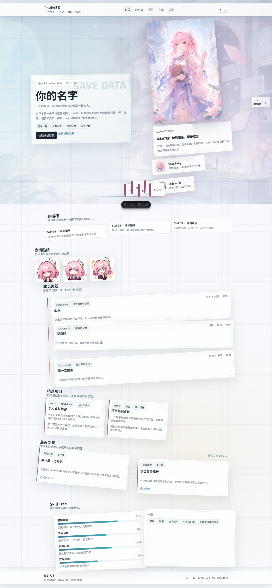
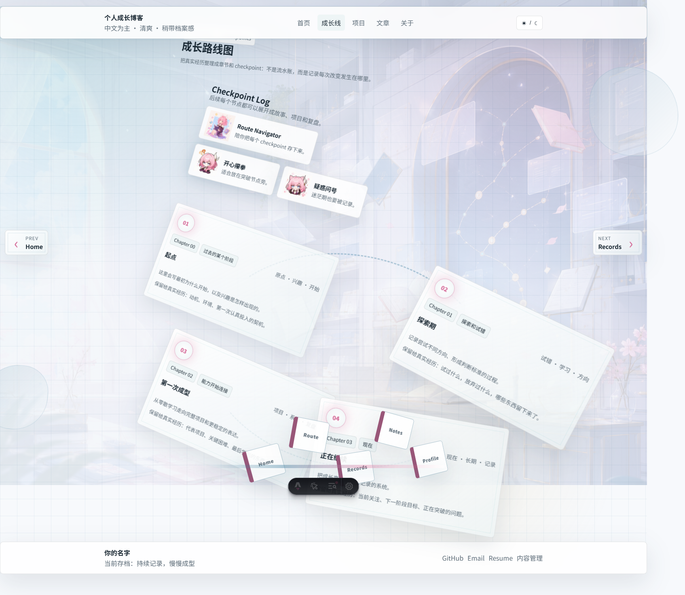
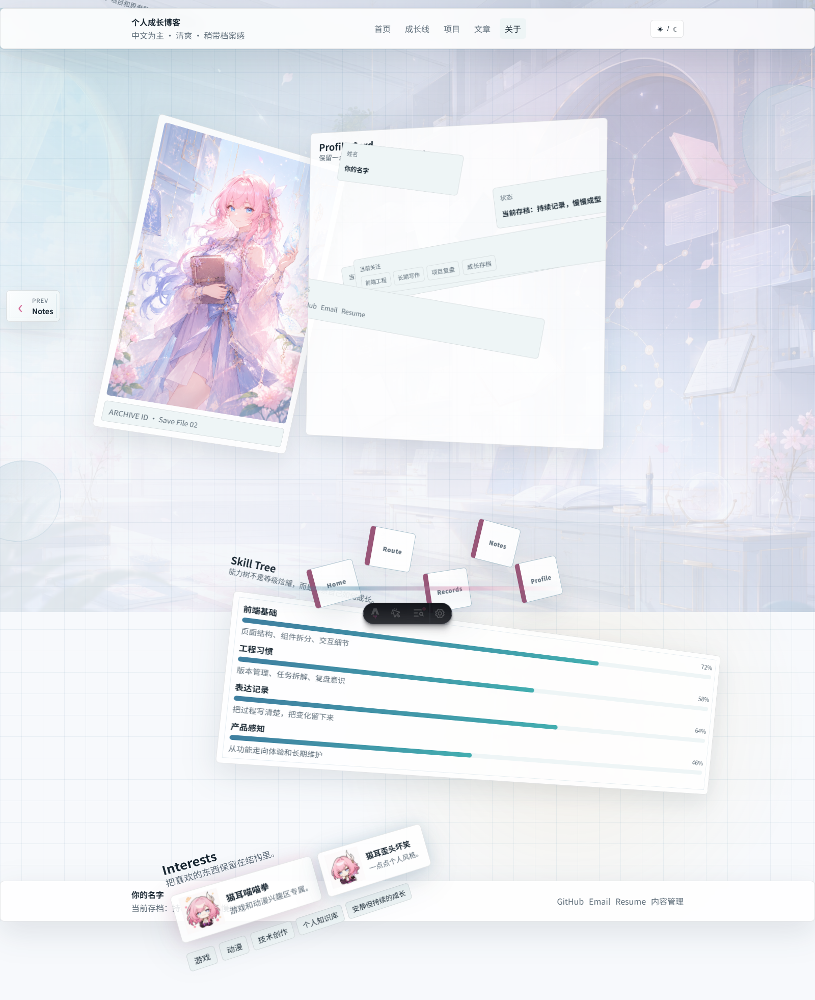
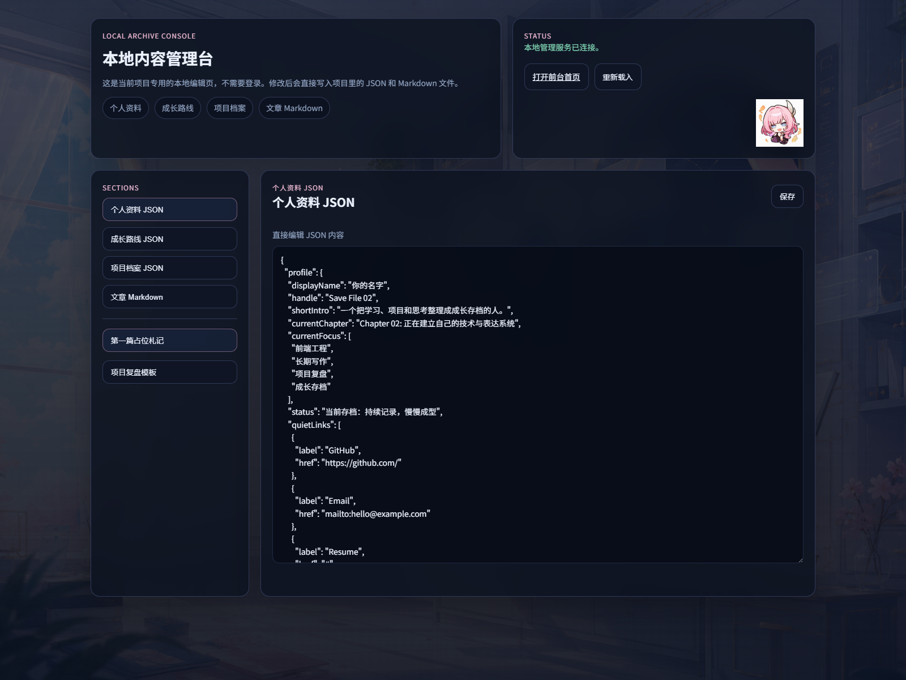

# Houraiji Blog

一个中文为主的个人成长博客，用来记录真实的成长线，也可以作为低调、克制、带一点个人风格的展示站点。

当前版本的视觉方向是“成长存档 / Visual Novel Archive”：在简洁的个人网站骨架里，融入轻量的游戏、动漫、档案室、图书馆和角色资料卡元素。

## 当前页面

目前网站已经完成的主要页面如下：

| 页面 | 路由 | 当前呈现 |
| --- | --- | --- |
| 首页 | `/` | 读取存档过场、成长存档入口、精选项目、最近文章、技能树和兴趣概览 |
| 成长线 | `/growth/` | 路线图式 checkpoint 视图，按章节展示成长节点 |
| 项目 | `/projects/` | 档案卡片式项目展示，强调角色、技术栈和复盘 |
| 文章 | `/articles/` | 图书馆书架风格的文章列表，支持 Markdown 详情页 |
| 关于 | `/about/` | 角色资料卡、当前章节、技能树、兴趣和联系方式 |
| 本地后台 | `/admin/index.html` | 本地专用内容管理台，可直接编辑 JSON 和 Markdown |

## 页面预览

### 首页



### 成长线



### 项目页


### 文章页


### 关于页



### 本地后台



## 页面风格概览

### 首页

- 以“读取成长存档”为主叙事入口
- 带动漫助手立绘、状态窗口、存档槽和表情贴纸
- 点击按钮会进入成长线页面，形成轻量过场感

### 成长线

- 使用路线图而不是普通时间线列表
- 每个节点保留章节、时间范围、关键词和详细说明
- 页面里加入导航贴纸和轻量 RPG 档案感

### 项目页

- 不是传统作品墙，而是“记录档案”
- 每个项目卡片会同时展示描述、承担角色、技术栈和复盘
- 视觉上偏资料卡和文件夹展开的感觉

### 文章页

- 文章列表做成“札记图书馆 / 书架”风格
- 支持文章分类、文章卡片和 Markdown 详情页
- 更适合放长期写作、阶段复盘和学习记录

### 关于页

- 用“角色资料卡”的形式展示个人信息
- 左侧是立绘，右侧是状态、当前章节、当前关注和联系方式
- 下方保留技能树和兴趣区域，整体更像角色档案页

### 本地后台

- 不走线上登录流程
- 面向当前项目本地使用
- 可以直接编辑：
  - `src/data/profile.json`
  - `src/data/growth.json`
  - `src/data/projects.json`
  - `src/content/articles/*.md`

## 当前特性

- 中文为主的个人成长博客结构
- 带一点动漫和游戏气质，但整体保持低调克制
- 首页“读取存档”过场动效
- 各页面档案卡 / 书籍归位感入场动效
- 左右页面切换箭头
- 深浅主题切换
- Markdown 文章系统
- JSON 数据化内容结构
- 本地专用内容管理页

## 技术栈

- [Astro](https://astro.build/)
- TypeScript
- Markdown Content Collections
- 原生 CSS 动效

## 本地运行

安装依赖：

```bash
npm install
```

启动前台开发服务器：

```bash
npm run dev
```

默认访问：

```text
http://127.0.0.1:4321/
```

## 本地内容管理

当前项目提供一个本地专用后台，不需要账号密码登录。

启动本地管理服务：

```bash
npm run admin:local
```

然后打开：

```text
http://127.0.0.1:4321/admin/index.html
```

这个本地后台可以直接编辑：

- 个人资料、技能树、兴趣
- 成长路线节点
- 项目档案
- Markdown 文章内容

## 常用命令

```bash
npm run dev          # 启动 Astro 开发服务器
npm run check        # 类型和内容检查
npm run build        # 构建静态站点
npm run preview      # 预览构建结果
npm run admin:local  # 启动本地管理服务
```

## 目录结构

```text
src/
├─ components/          # 页面组件、页头页脚、贴纸、页面箭头等
├─ content/
│  └─ articles/         # Markdown 文章
├─ data/                # profile / growth / projects 的 JSON 数据
├─ layouts/             # 全站布局
├─ pages/               # 首页、成长线、项目、文章、关于
└─ styles/              # 全局样式和动效

public/
├─ admin/               # 本地管理页静态资源
└─ assets/              # 站点视觉资产、生成图片、贴纸

scripts/
└─ local-admin-server.mjs
```

## 内容文件位置

文章内容：

```text
src/content/articles/
```

个人资料、技能树、兴趣：

```text
src/data/profile.json
```

成长路线：

```text
src/data/growth.json
```

项目档案：

```text
src/data/projects.json
```

## 部署

这是一个静态 Astro 项目，可以部署到：

- Vercel
- Netlify
- Cloudflare Pages
- GitHub Pages

构建命令：

```bash
npm run build
```

构建产物目录：

```text
dist/
```

## 后续可以继续做的事

- 替换成真实的成长内容和项目经历
- 给 README 补充页面截图
- 增加文章归档、标签页、搜索
- 继续扩展本地后台的表单化编辑体验
- 如果需要，再接线上可登录的内容管理能力
